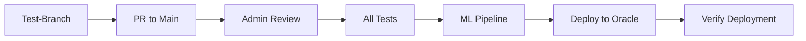

# Modern CI/CD Workflow Guide

This guide explains the modern CI/CD workflow implemented for the ML pipeline project.

## 🌿 Branching Strategy

### Branch Hierarchy
```
Feature Branches → Test-Branch → Main → Production
```

### Branch Roles

#### 🔧 Feature Branches
- **Purpose**: Individual development work
- **Naming**: `feature/description`, `bugfix/description`, `hotfix/description`
- **Workflow**: 
  - Developers work on their features
  - Create PR to `Test-Branch` when ready
  - Basic tests run automatically

#### 🧪 Test-Branch
- **Purpose**: Team collaboration and testing
- **Workflow**:
  - All team members create PRs here
  - Full ML pipeline runs (test, preprocess, train)
  - **NO deployment** (testing only)
  - Code review required
  - Admin merges to `main` when approved

#### 🔒 Main Branch
- **Purpose**: Production-ready code
- **Workflow**:
  - Only admin can merge here
  - Full ML pipeline runs (test, preprocess, train)
  - **Deployment runs automatically** to Oracle Cloud
  - Production deployment

## 🚀 CI/CD Pipeline Flow

### 1. Feature Development
```bash
# Create feature branch
git checkout -b feature/new-model

# Make changes
git add .
git commit -m "Add new model feature"

# Push to remote
git push origin feature/new-model

# Create PR to Test-Branch
```

### 2. Test-Branch Workflow


**What runs on Test-Branch:**
- ✅ Code quality checks
- ✅ Security scans
- ✅ Documentation checks
- ✅ Unit tests
- ✅ Data preprocessing
- ✅ Model training
- ✅ Performance evaluation
- ❌ **NO deployment**

### 3. Main Branch Workflow


**What runs on Main:**
- ✅ All Test-Branch checks
- ✅ Full ML pipeline
- ✅ **Oracle Cloud deployment**
- ✅ Service configuration
- ✅ Deployment verification

## 📋 Workflow Rules

### For Developers
1. **Never push directly to `main`**
2. **Create feature branches** for all work
3. **PR to `Test-Branch`** for review
4. **Wait for admin approval** before merging to `main`

### For Admins
1. **Review PRs** in `Test-Branch`
2. **Merge to `main`** only when approved
3. **Monitor deployment** to Oracle Cloud
4. **Verify production** is working

### Branch Protection
- **Main branch**: Requires admin approval
- **Test-Branch**: Requires code review
- **Feature branches**: No restrictions

## 🔧 Pipeline Jobs

### Test-Branch Jobs
1. **test**: Run unit tests
2. **preprocess**: Extract and transform data
3. **train**: Train and evaluate models
4. **summary**: Display results summary

### Main Branch Jobs
1. **test**: Run unit tests
2. **preprocess**: Extract and transform data
3. **train**: Train and evaluate models
4. **deploy**: Deploy to Oracle Cloud
5. **summary**: Display results summary

### Additional Jobs (All Branches)
1. **code-quality**: Linting and structure checks
2. **security**: Security scanning
3. **documentation**: Documentation validation
4. **pr-validation**: Pull request validation
5. **branch-checks**: Branch-specific validation

## 🎯 Benefits

### Team Collaboration
- ✅ **Safe testing** on Test-Branch
- ✅ **Code review** process
- ✅ **No accidental deployments**
- ✅ **Clear approval workflow**

### Quality Assurance
- ✅ **Multiple validation layers**
- ✅ **Automated testing**
- ✅ **Security scanning**
- ✅ **Documentation checks**

### Production Safety
- ✅ **Admin-only main merges**
- ✅ **Automatic deployment**
- ✅ **Deployment verification**
- ✅ **Rollback capability**

## 📊 Monitoring

### GitHub Actions Dashboard
- View pipeline status in **Actions** tab
- Check individual job logs
- Monitor deployment status

### Oracle Cloud Monitoring
- Check service status: `sudo systemctl status mlpipeline`
- View logs: `journalctl -u mlpipeline`
- Monitor resources: `htop`, `df -h`

## 🚨 Troubleshooting

### Common Issues

#### Pipeline Fails on Test-Branch
1. Check test logs for specific errors
2. Fix code issues
3. Push changes to feature branch
4. PR will automatically re-run

#### Deployment Fails on Main
1. Check Oracle server connectivity
2. Verify SSH secrets are configured
3. Check server resources
4. Review deployment logs

#### Code Review Issues
1. Address reviewer comments
2. Update PR description
3. Request re-review
4. Wait for admin approval

## 📞 Support

For workflow questions:
1. Check this guide first
2. Review GitHub Actions logs
3. Contact admin for main branch issues
4. Use team chat for Test-Branch collaboration

---

**Remember**: Always create PRs to `Test-Branch` first, never directly to `main`! 🎯 